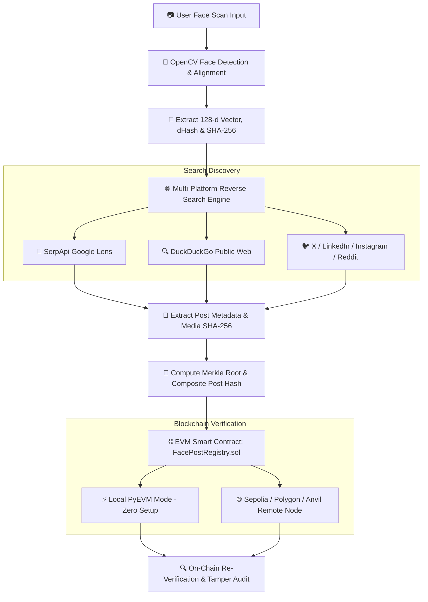

# 👁️ Face Scan to Blockchain Social Media Verification Pipeline ⛓️

[](LICENSE)
[](https://www.python.org/)
[](https://web3py.readthedocs.io/)
[](https://soliditylang.org/)

An end-to-end decentralized identity and anti-tamper verification pipeline. This system accepts a face scan input, computes normalized 128-dimensional biometric embeddings and SHA-256 cryptographic signatures, performs a multi-platform reverse visual & web search (across **Instagram, X/Twitter, LinkedIn, Reddit, and Google Lens**), and cryptographically anchors the social media records onto an **EVM Blockchain Smart Contract** (`FacePostRegistry.sol`).

---

## 📐 Architecture & System Flow



---

## 🌟 Key Features

### 1. 👤 Facial Biometrics & Cryptographic Signatures
- **OpenCV Frontal Face Detection**: Image contrast normalization, CLAHE histogram equalization, and facial alignment.
- **Biometric Embeddings**: Generates a **128-dimensional normalized feature descriptor** capturing spatial gradient energy.
- **Perceptual dHash**: Calculates structural difference hashes for visual match verification.
- **SHA-256 Crop Hashing**: Produces an immutable, byte-level hash of the face crop for on-chain identity binding.

### 2. 🌐 Multi-Platform Live Social Media & Web Search
- **Live Search Adaptability**: Queries public web & social platforms for matching posts without hardcoded sample data.
- **SerpApi Google Lens Reverse Search**: Performs reverse visual search across public web indices (**Instagram, X/Twitter, LinkedIn, Reddit, news outlets**). Extracts `visual_matches`, `organic_results`, and `related_content`.
- **Media Image SHA-256 Fingerprinting**: Downloads post media assets to compute raw `media_sha256` hashes for strict anti-spoofing verification.

### 3. ⛓️ EVM Blockchain Anchoring (`FacePostRegistry.sol`)
- **Solidity Smart Contract**: Deploys `FacePostRegistry.sol` to record composite identity proofs:
  `Record(faceHash, postHash, postUrl, author, platform, timestamp, registeredBy)`
- **Merkle Tree Proofs**: Roots face crop hashes, post text canonical hashes, and image media hashes into a single 32-byte Merkle root.
- **Flexible Execution Modes**:
  - **Local EVM (`BLOCKCHAIN_MODE=local`)**: Built-in PyEVM (`EthereumTesterProvider`). Fast, zero-gas, zero-faucet, isolated in-memory test environment.
  - **Remote Testnets (`BLOCKCHAIN_MODE=remote`)**: Instant deployment to Sepolia, Polygon Amoy, Arbitrum Sepolia, or local Anvil/Hardhat nodes.

### 4. 🛡️ Real-Time Tamper-Evidence Auditor
- **On-Chain Audit (`verifyRecord`)**: Queries smart contract bytecode directly to confirm state authenticity.
- **Adversary Attack Simulation**: Demonstrates anti-tamper resilience—modifying a single character of text or altering 1 pixel of media image generates a mismatched hash and triggers instant on-chain rejection (`is_valid == False`).

---

## 📁 Repository Structure

```
.
├── blockchain/
│   ├── FacePostRegistry.json   # Compiled Smart Contract ABI and Bytecode
│   ├── evm_client.py           # Web3.py EVM client handler (PyEVM local & Remote RPC)
│   └── hasher.py               # Merkle Tree, SHA-256, & bytes32 conversion utilities
├── contracts/
│   └── FacePostRegistry.sol    # Solidity smart contract for face-post anchoring
├── pipeline/
│   ├── face_engine.py          # OpenCV face detection, alignment, 128-d vector & dHash
│   ├── search_engine.py        # Reverse image search adapter (SerpApi Lens & DDGS)
│   └── verifier.py             # Blockchain verification & adversary tamper simulator
├── samples/                    # Sample portrait images for testing & demonstration
│   ├── test_face_1.jpg
│   ├── test_face_2.jpg
│   └── synthetic_portrait.jpg
├── tests/
│   └── test_pipeline.py        # Automated unittest test suite (9 pass out-of-the-box)
├── web/                        # Modern Glassmorphic Dark-Themed Frontend UI
│   ├── index.html              # Interface markup with interactive scanner & tamper lab
│   ├── style.css               # Modern CSS styling & glassmorphism components
│   └── app.js                 # Frontend API handler & interactive scanner controller
├── .env.example                # Environment variables template
├── app.py                      # CLI entrypoint wrapper
├── main.py                     # Core CLI implementation
├── package.json                # npm scripts for running dev server & tests
├── requirements.txt            # Python dependencies
├── server.py                   # Lightweight HTTP API & Static File Server (Port 3000)
└── README.md                   # Detailed documentation
```

---

## ⚙️ Configuration (`.env`)

Copy `.env.example` to `.env` to configure your preferred blockchain mode and search provider:

```bash
cp .env.example .env
```

```ini
# --- Blockchain Settings ---
# Set to 'local' for zero-setup local EVM (Web3.py PyEVM)
# Set to 'remote' when connecting to Sepolia / Anvil / Hardhat
BLOCKCHAIN_MODE=local

# Required ONLY if BLOCKCHAIN_MODE=remote:
# RPC_URL=https://rpc.sepolia.org
# PRIVATE_KEY=0xYOUR_PRIVATE_KEY_HERE
# CONTRACT_ADDRESS=0xYOUR_DEPLOYED_CONTRACT_ADDRESS_HERE  # Optional (deploys if omitted)

# --- Reverse Image Search Settings ---
# Optional: Provide SerpApi key for real-time Google Lens reverse image search
SERPAPI_API_KEY=your_serpapi_key_here
```

---

## 🚀 Quick Start Guide

### 1. Prerequisites & Installation

Ensure **Python 3.10+** and **Node.js** are installed:

```bash
# Clone the repository
git clone https://github.com/Pavan-VPM/HHGOA_Task-3.git
cd HHGOA_Task-3

# Create and activate Python virtual environment
python3 -m venv myenv
source myenv/bin/activate    # On Windows: myenv\Scripts\activate

# Install Python dependencies
pip install -r requirements.txt
```

---

### 2. Launch the Web Application

Start the integrated web server:

```bash
npm run dev
# or
python3 server.py
```

Open **[http://localhost:3000](http://localhost:3000)** in your browser to access the Web UI:

- 📷 **Interactive Scanner**: Upload custom facial images or select built-in sample portraits.
- ⚡ **Pipeline Stepper**: Real-time visual progress of facial detection, web discovery, and EVM anchoring.
- 🧪 **On-Chain Audit & Tamper Lab**:
  - Click **Re-Verify Authentic State** to test cryptographic validity against the smart contract.
  - Click **Simulate Adversary Attack** to tamper with post content and witness on-chain cryptographic rejection.

---

### 3. CLI Command Usage

#### Run Full Pipeline via CLI:
```bash
# Using sample image
python3 main.py run --image samples/test_face_1.jpg --query "Satya Nadella"

# Using a custom image file or public image URL
python3 main.py run --image "https://example.com/portrait.jpg" --query "Elon Musk"
```

#### Verify Saved Blockchain State:
```bash
python3 main.py verify
```

#### Run Built-In Pipeline Demo:
```bash
python3 main.py demo
```

---

## 🧪 Automated Testing

Execute the test suite covering blockchain smart contracts, Merkle trees, biometric feature extraction, and search engine integration:

```bash
npm test
# or
python3 -m unittest discover -s tests -v
```

**Test Suite Coverage**:
- `test_contract_deployment`: Smart contract compilation & EVM deployment.
- `test_registration_and_tamper_verification`: Record registration & on-chain integrity checking.
- `test_merkle_root_computation`: Merkle root hashing determinism.
- `test_face_detection_and_encoding`: OpenCV face detection & 128-d vector generation.
- `test_face_comparison`: Biometric distance scoring.
- `test_social_url_check` & `test_platform_detection`: Domain matching for social platforms.

---

## 🌐 Web API Endpoints (`server.py`)

| Endpoint | Method | Description |
|---|---|---|
| `/` | `GET` | Serves the web interface (`web/index.html`) |
| `/api/samples` | `GET` | Lists available sample portrait images |
| `/api/run` | `POST` | Executes face scan, social search, and EVM deployment |
| `/api/verify` | `GET` | Re-verifies existing record against current smart contract state |
| `/api/tamper` | `POST` | Simulates post text/image tampering and tests on-chain response |

---

## ☁️ Deployment Guide

### Option 1: Render.com *(Recommended for Python Web Services)*
1. Connect your GitHub repository to [Render.com](https://render.com).
2. Create a new **Web Service**.
3. Configure settings:
   - **Environment**: `Python 3`
   - **Build Command**: `pip install -r requirements.txt`
   - **Start Command**: `python3 server.py`
4. Add environment variables (`SERPAPI_API_KEY`, `BLOCKCHAIN_MODE`, etc.) in the Render dashboard.

### Option 2: Railway.app
1. Link your repo to [Railway.app](https://railway.app).
2. Set **Start Command**: `python3 server.py`.
3. Add environment variables under Railway service configuration.

---

## 🛡️ Security & Anti-Tamper Guarantees

| Component | Fingerprinting Method | Tamper Resilience |
|---|---|---|
| **Face Crop** | SHA-256 of 160x160 aligned crop | Changing face pixels alters `faceHash` |
| **Social Post** | Canonical SHA-256 of post payload | Altering 1 character alters `postHash` |
| **Media Image** | SHA-256 of raw image bytes | Swapping images invalidates `media_sha256` |
| **Composite Proof** | Merkle Root + On-Chain Contract Storage | Smart contract rejects altered hashes (`is_valid == False`) |

---

## 📄 License

This project is licensed under the [MIT License](LICENSE).
